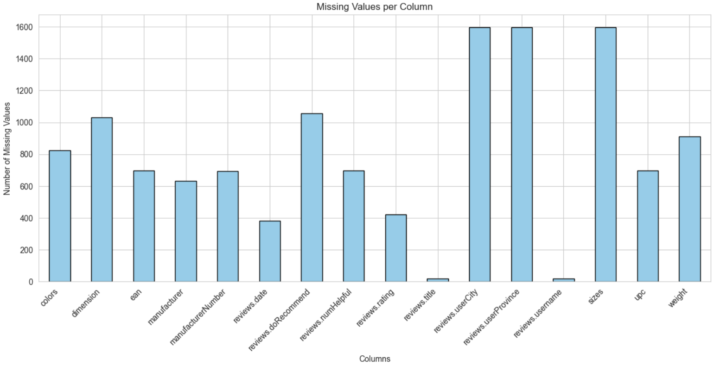
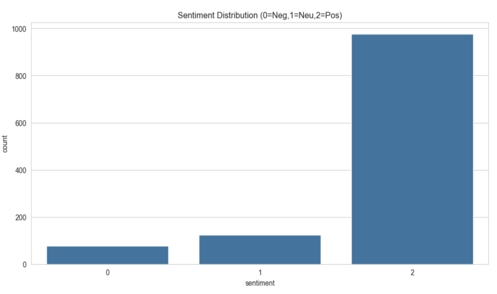
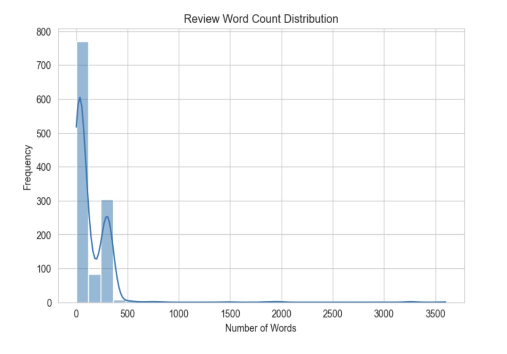
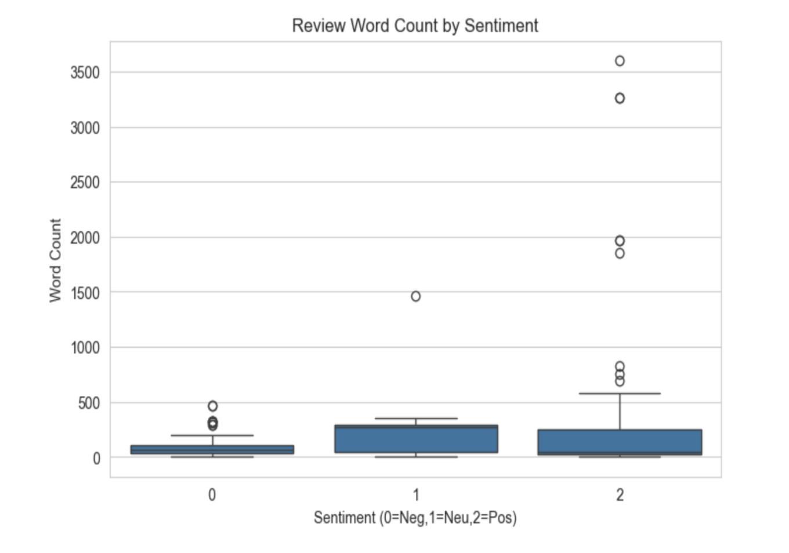
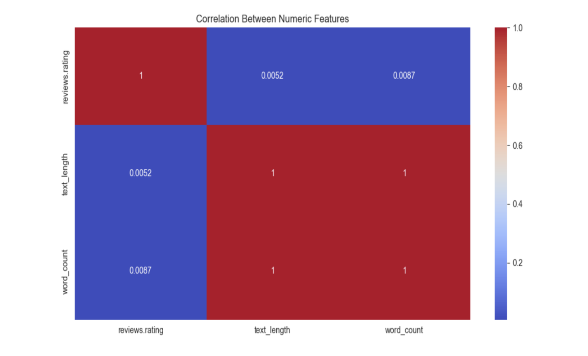
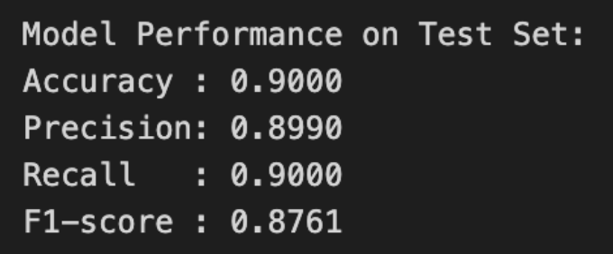

# Multimodal Review Sentiment Analysis

## Project Overview

This project performs sentiment analysis on product reviews using machine learning techniques. The goal is to classify reviews into three sentiment categories: Negative (0), Neutral (1), and Positive (2).

## Dataset Description

The dataset contains product reviews with the following key features:
- **reviews_rating**: User rating for the product
- **reviews_text**: The actual review text content
- **reviews_title**: Title of the review
- **reviews_username**: Username of the reviewer
- **reviews_doRecommend**: Whether the user recommends the product
- **manufacturer**: Product manufacturer
- **ean**: Product identifier
- **dimension**: Product dimensions
- **colors**: Product color options
- And various other product-related features

## Exploratory Data Analysis (EDA)

### 1. Missing Values Analysis



The dataset shows varying levels of missing data across different columns:
- **High missingness**: `reviews_userCity`, `reviews_userProvince`, and `reviews_username` have approximately 1,600 missing values each
- **Moderate missingness**: Features like `dimension`, `reviews_doRecommend`, and `reviews_numHelpful` have around 700-1,050 missing values
- **Low missingness**: Most review-related features (text, rating, date) have relatively complete data

### 2. Sentiment Distribution



The sentiment analysis reveals:
- **Positive reviews (2)**: Approximately 975 reviews (~80% of dataset)
- **Neutral reviews (1)**: Approximately 125 reviews (~10% of dataset)
- **Negative reviews (0)**: Approximately 75 reviews (~6% of dataset)

**Key Insight**: The dataset exhibits a significant class imbalance, with positive reviews dominating the dataset.

### 3. Review Word Count Distribution



Analysis of review lengths shows:
- Most reviews are **short to medium length** (0-500 words)
- The distribution is **heavily right-skewed**
- Peak frequency occurs at very short reviews (0-100 words)
- Some outliers exist with reviews exceeding 3,000 words

### 4. Word Count by Sentiment



Comparing word counts across sentiment categories:
- **Negative reviews (0)**: Tend to be shorter (median ~100 words)
- **Neutral reviews (1)**: Medium length (median ~150-200 words)
- **Positive reviews (2)**: Similar to neutral (median ~150 words)
- All categories show outliers with extremely long reviews (up to 3,500 words)

**Key Insight**: Sentiment doesn't strongly correlate with review length, though negative reviews tend to be slightly more concise.

### 5. Feature Correlation Analysis



Correlation analysis reveals:
- **text_length and word_count**: Perfect positive correlation (1.0) - as expected
- **reviews_rating**: Shows very weak correlation with text length (0.0052) and word count (0.0087)
- All numeric features are nearly independent of each other

**Key Insight**: Rating doesn't depend on review length, suggesting users express opinions regardless of verbosity.

##  Technologies Used

- **Python**: Primary programming language
- **Pandas**: Data manipulation and analysis
- **NumPy**: Numerical computing
- **Matplotlib/Seaborn**: Data visualization
- **Scikit-learn**: Machine learning algorithms
- **NLTK/spaCy**: Natural language processing
- **Jupyter Notebook**: Development environment

##  Project Structure

```
project-root/
│
├── data/
│   ├
│   └── amazon_fashion_reviews.csv                    # Original dataset
│
├── notebooks/
│   ├── 01_eda.ipynb           # Exploratory data analysis
│   └── 02_modeling.ipynb       # Model training and evaluation
│
├── src/
│   ├── dataset.py  
│   ├── evaluate.py 
│   ├── model.py 
│   └── train.py    
│
├── images/                     # EDA visualizations
│   ├── missing_values.png
│   ├── sentiment_distribution.png
│   ├── word_count_distribution.png
│   ├── word_count_by_sentiment.png
│   └── correlation_heatmap.png
│
├── README.md
└── requirements.txt
```

## Getting Started

### Prerequisites

```bash
Python 3.8 or higher
pip package manager
```

### Installation

1. Clone the repository:
```bash
git clone https://github.com/prashangc/Multimodal-Product-Review-Sentiment-Analysis.git
cd sentiment-analysis-project
```

2. Install required packages:
```bash
pip install -r requirements.txt
```

3. Download NLTK data (if required):
```python
import nltk
nltk.download('stopwords')
nltk.download('punkt')
nltk.download('wordnet')
```

### Usage

1. **Data Preprocessing**:
```python
python src/data_preprocessing.py
```

2. **Feature Engineering**:
```python
python src/feature_engineering.py
```

3. **Model Training**:
```python
python src/model.py
```

4. **Run Jupyter Notebooks**:
```bash
jupyter notebook
```

## Methodology

1. **Data Collection**: Product review dataset with ratings and text
2. **Data Cleaning**: Handle missing values, remove duplicates
3. **Exploratory Data Analysis**: Understand data distribution and patterns
4. **Text Preprocessing**: 
   - Tokenization
   - Lowercasing
   - Stopword removal
   - Lemmatization/Stemming
5. **Feature Extraction**:
   - TF-IDF vectorization
   - Word embeddings (Word2Vec/GloVe)
6. **Model Training**:
   - Logistic Regression
   - Random Forest
   - Support Vector Machines
   - Deep Learning models (LSTM/BERT)
7. **Model Evaluation**: Accuracy, Precision, Recall, F1-Score
8. **Hyperparameter Tuning**: Grid Search/Random Search

##  Results




## Key Findings

1. **Class Imbalance**: The dataset is heavily skewed towards positive reviews (80%), requiring careful handling during model training
2. **Review Length**: Most reviews are concise (under 500 words), with no strong correlation between length and sentiment
3. **Missing Data**: Significant missing values in user demographic information may limit personalization features
4. **Feature Independence**: Numeric features show minimal correlation, suggesting diverse information sources

##  Future Improvements

- [ ] Implement SMOTE or other techniques to handle class imbalance
- [ ] Experiment with advanced NLP models (BERT, GPT)
- [ ] Add aspect-based sentiment analysis
- [ ] Create a web interface for real-time predictions
- [ ] Implement ensemble methods for better performance